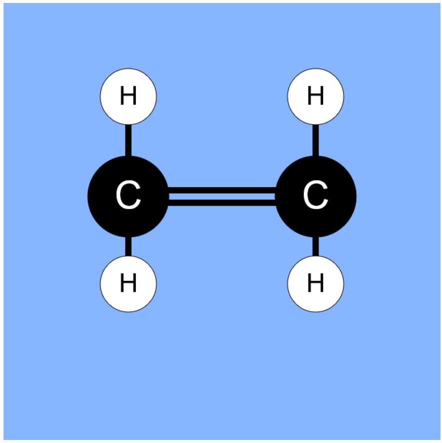
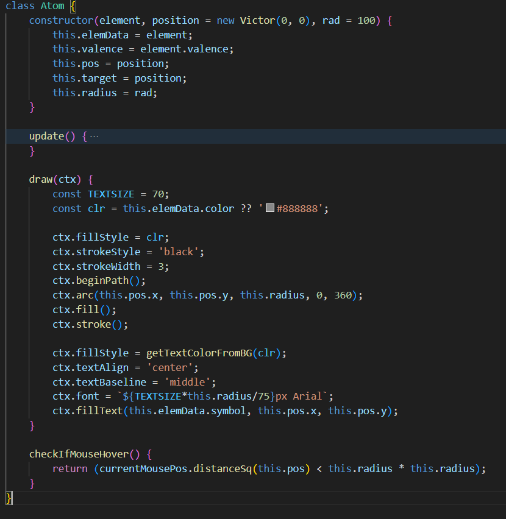
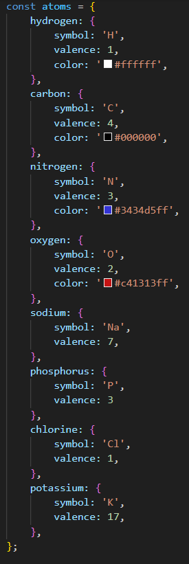

## Devlog #1 - 11/1/2025
# Introduction

This school year, for AP Biology Unit 1, I had to learn some stuff about molecules, bonds (covalent and ionic), and other basic chemistry stuff.

When the [Axiom YSWS](https://axiom.hackclub.com) came around, my first thought was "hey, science? I could make something chemistry-related!"
So I started this project.

I intend to make it have all the essentials of a molecule editor, like creating bonds and statistics like polarity.
~~If~~ When I learn more chemistry, I'll add in new features to match reality.

## Functionality

So far, I have atoms and bonds drawn to the screen. As an example, here's a molecule of ethene!

There's no logic for location of atoms, so I've placed these manually.

## Code

So far, I've made some classes for atoms and the molecule, which are in their respective files. Here's the `Atom` class.

The `update` function is hiding some upcoming changes, so be patient!

I've also made some boilerplate animation and testing code, which is in `index.js`.

In `const.js` is located possibly the dumbest architecture in this project, the `atoms` object!!!
All the data is entered manually. I don't know how to do better than this to be honest.

 
 

[Next Devlog -->](DEVLOG_2.md)