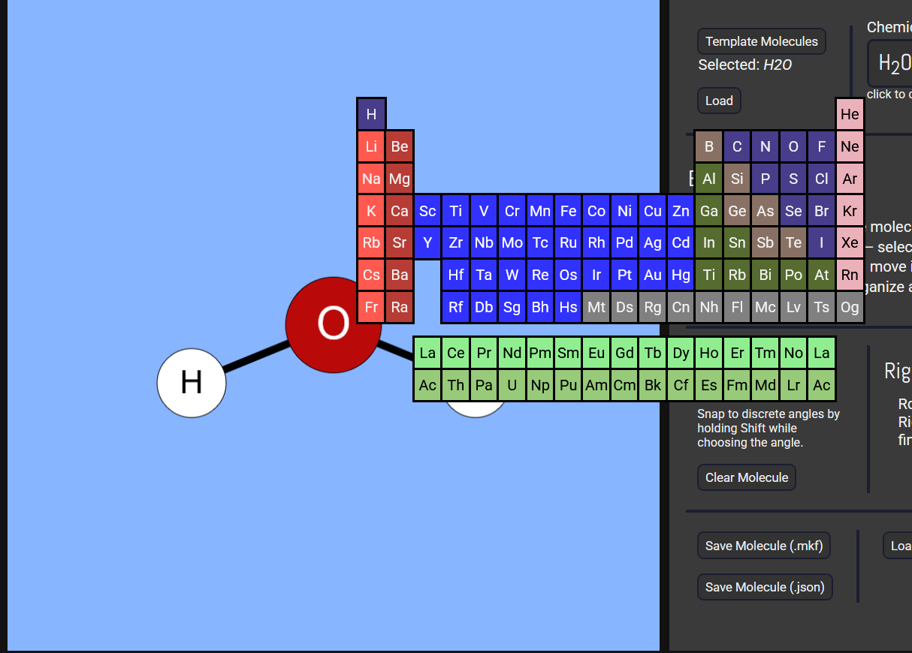

## Devlog #19 - 12/13/2025
# Axiom V2

#### Hey I'm back !!!

This project was created for Axiom, a YSWS from Hack Club. Now, Axiom is running again! I have 9 days to make this project a lot better.  
So the first things I did were...

## Changed the atom menu!

This is the coolest thing I did today, turning the atom dropdown menu into the entire periodic table! Here's a screenshot of it appearing when you press A.  

Only the ones I've added will actually do anything when clicked. I'll add more, though.

## Atoms I've added

I've added the following atoms, which round out the bottom 10.
- Helium
- Lithium
- Beryllium
- Boron
- Flourine
- Neon

Have fun making molecules with those.

## Fixed some issues

I fixed some bugs like bonding an atom to itself.

 
 

Welcome back to my yappings!

[<-- Previous Devlog](DEVLOG_18.md)<!--   [Next Devlog --\>](DEVLOG_19.md)-->