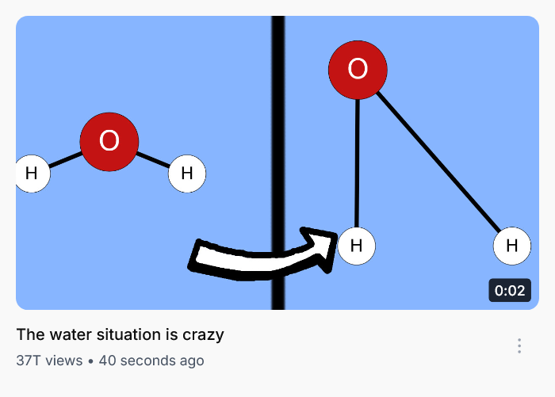
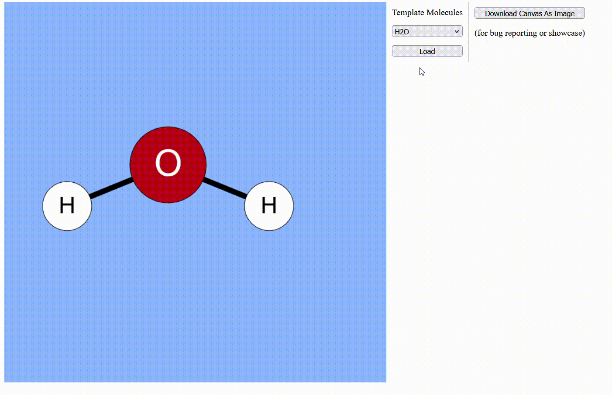

## Devlog #2 - 11/2-3/2025
# Playing God

The next important step to making a molecule editor is to allow moving the molecules!!! So I did that. Now you can grab the molecule and drag it around. 

Holding shift allows you to move an atom individually. Don't worry, it'll stay bonded to the rest! It may look weird though...

 

### I took it a step further, though.

Not only can you move the molecules around, you can make them organize around a common neighbor. For example, in this methane molecule, you can make the four hydrogen atoms rotate to a different angle around the carbon, even if they're out of sync!

Their distance from the central neighbor will be averaged and applied to all of them, to make things pretty.

This is done with three right clicks. One on the central molecule, then one on the "anchor", then a final one to decide the angle.
The "anchor" is sent to the angle you chose and the rest of the neighbors follow suit.

## Other Comments

I intend to make many more preset orientation tools like this in the future. There'll be a menu or something for it.
My ideas for them right now are:
- T-Shaped Intersection
- L-Shaped Intersection
- Maybe just individual atom angling tools

The angle logic for this stuff was really frustrating sometimes, but I made it lol.

 
 

[<-- Previous Devlog](DEVLOG_1.md)<!--   [Next Devlog --\>](DEVLOG_11.md)-->