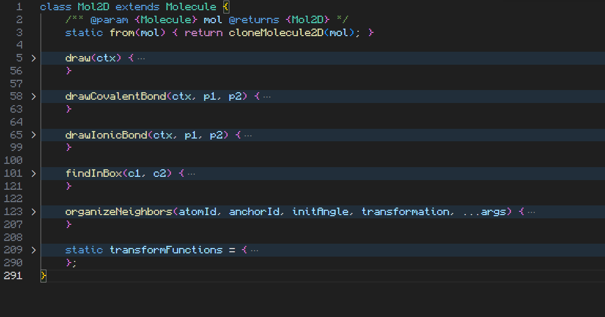

## Devlog #23 - 9/11/2026
# In 3-D

Hey, I'm back! After a summer's worth of learning chemistry in preparation for my AP Chemistry course, I am returning to make this project better and to add new stuff!
The third day of the school year was today, and I'm really excited for all the stuff I am to learn in AP Chem.  
So, what am I adding now? Well...

## Refactoring

Yeah, always.  
I had to change a bunch of stuff just because it was either badly planned out originally or it doesn't fit what I'm planning to do. I pulled things specific to the `index.js` code out of `const.js` to make it more broad.  
I plan to put everything about the main project into a sub-folder so that I can turn this site into more of a collection of webapps, rather than just one with weird, misplaced offshoots.

I moved all the JS files with functions and processing logic in them into their own folder called `utils`. I made a folder named `class` for the JS files with classes like Molecule and Mol2D. Wait, what the hell is-

## The `Mol2D` Class

I made a new class called `Mol2D`, into which I moved all the 2D logic in the `Molecule` class. Things like drawing on the canvas, finding the atoms within a selection rectangle, and orientation operaitions all went into the new class.

Why did I do all of that? It was to prepare for the really big thing:  
**Molecules in 3 Dimensions!**

That's right, as you could have guessed by the title, I am making a *3D* molecule project! I know it'll be hard, but imagine how cool it'll be!  
Right now, I can't really write anything in the `Mol3D` class because I haven't implemented 3D graphics whatsoever; that's my next goal.

Another important thing I must do is to change how the `Atom` class works. Its data and methods need to be more scientifically accurate and helpful.

 
 

The next few devlogs *might* not all be about the same project; some might be about periodic table quiz games. I will be making multiple things, lol.

[<-- Previous Devlog](DEVLOG_22.md)<!--   [Next Devlog --\>](DEVLOG_24.md)-->