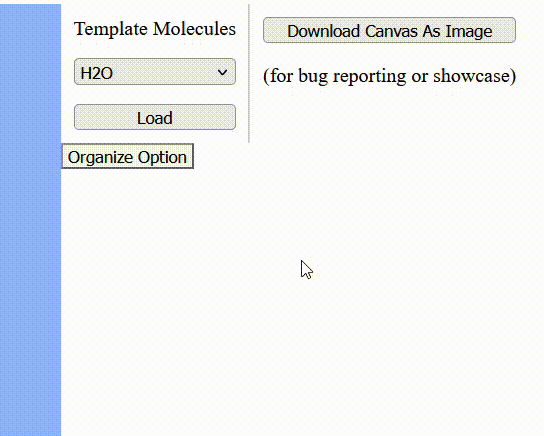
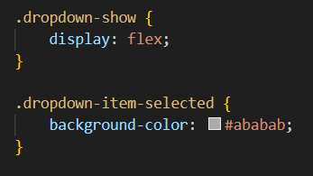
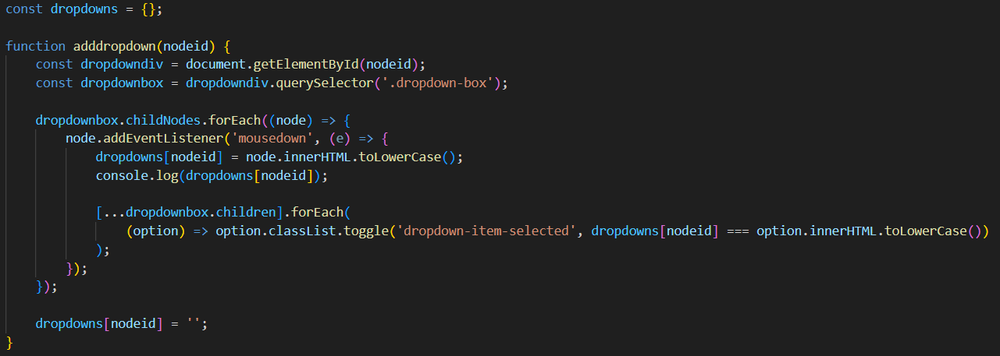

## Devlog #4 - 11/5/2025
# Dropping and Downing

I realized that, with all of the tools and options I'd be making, I need a system for selecting from a list. So I made a dropdown and selection system.
Here's how it looks!

## Code Explanation

There are 2 CSS classes that are added or removed for the functionality:
- dropdown-show
- dropdown-item-selected
Their purposes are like this, which are pretty basic.

Also, there's some logic for keeping track of selections. In `dropdown.js`, there's an object called `dropdowns` which stores every active dropdown in the HTML. You have to add them in with a script in the HTML, and the code looks like this:

 
 

Thank you for reading, and see you next time!

[<-- Previous Devlog](DEVLOG_3.md)   [Next Devlog -->](DEVLOG_5.md)