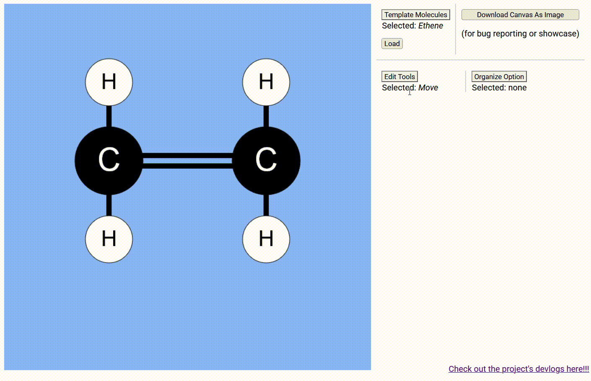

## Devlog #7 - 11/7/2025
# Doing Chemistry???

Maybe... people should be able to add atoms to make their own molecules! So I added the following tools:
- Moving atoms
- Adding atoms
- Deleting atoms
- Bonding atoms
- Unbonding atoms

Here's an example of me doing all of those things.

Right now, you can only add Hydrogen atoms, but I'll figure out a choice implementation method later.

 
 

Happy editing, and see you next time!

This has been a fun DEVLOG 6-7 AAAAAAAHHHHHH !!!!!!

[<-- Previous Devlog](DEVLOG_6.md)<!--   [Next Devlog --\>](DEVLOG_8.md)-->